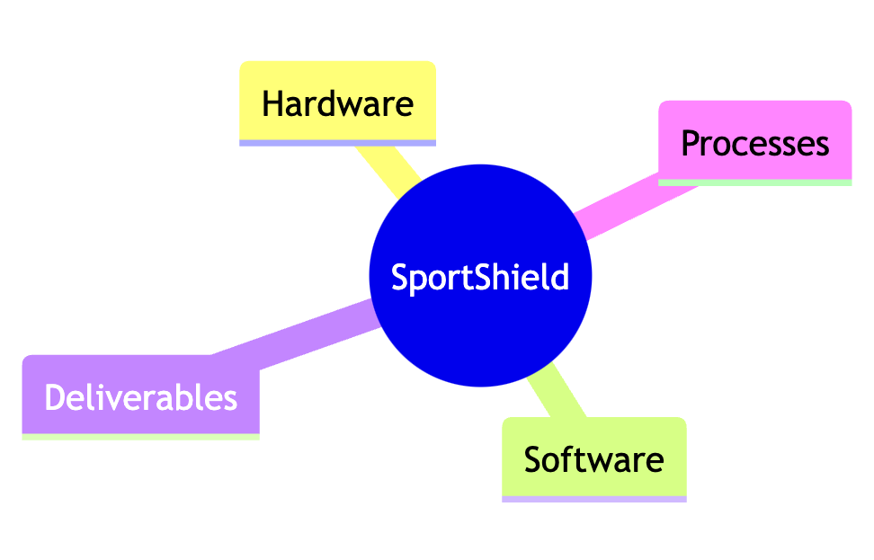
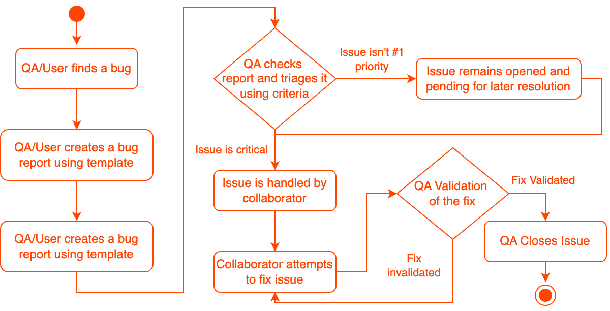
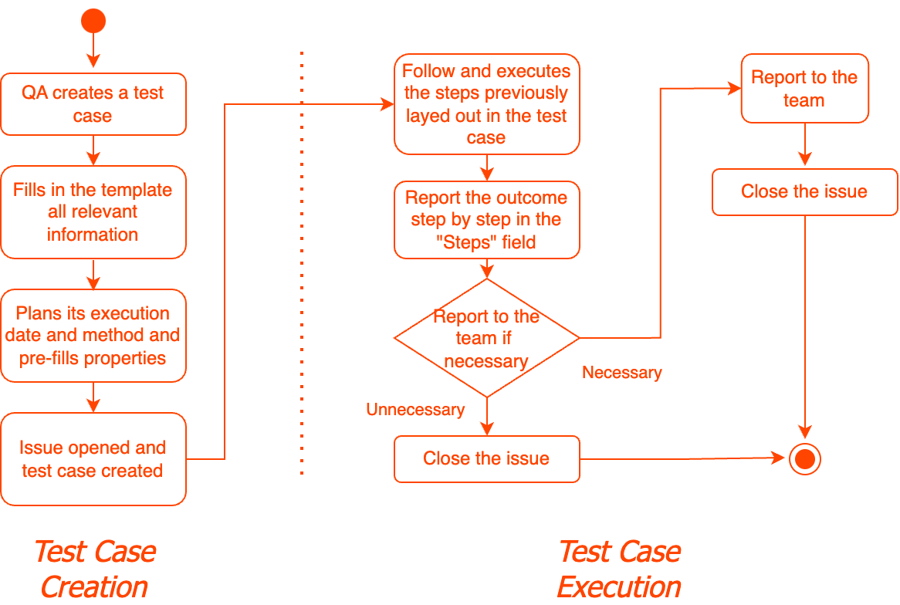
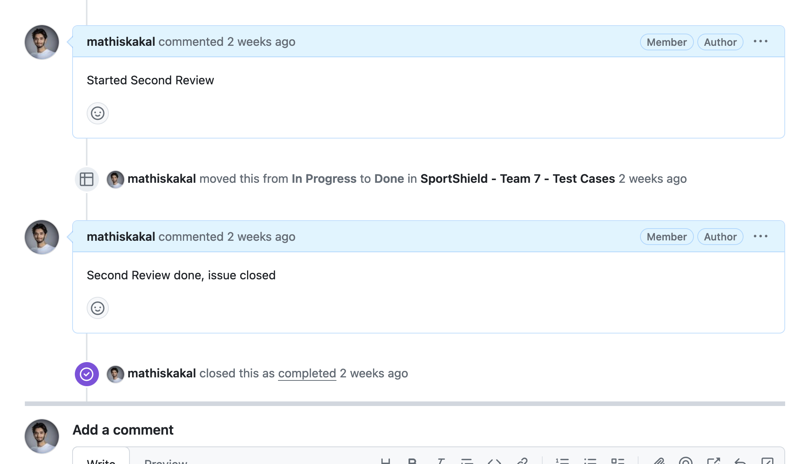
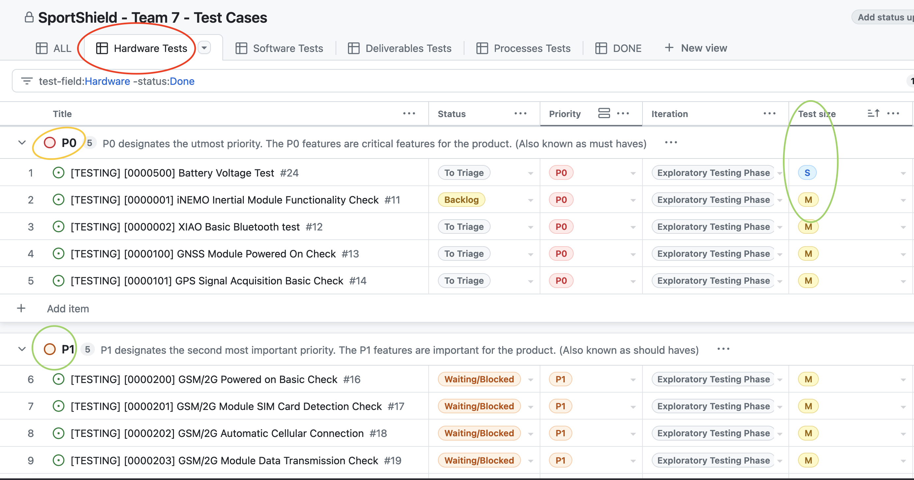
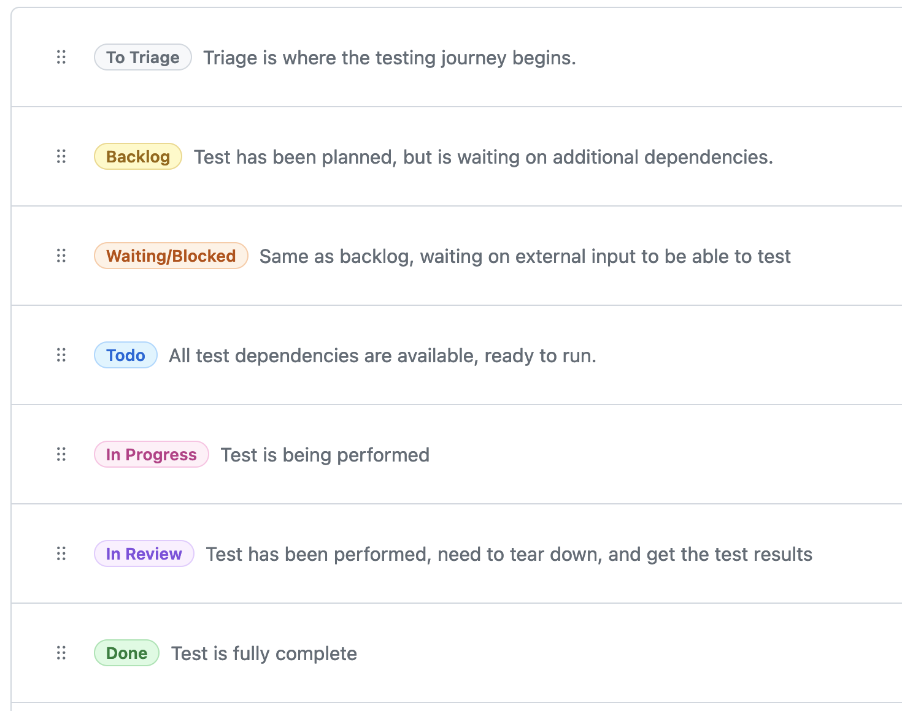
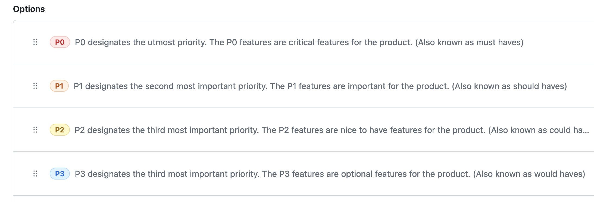
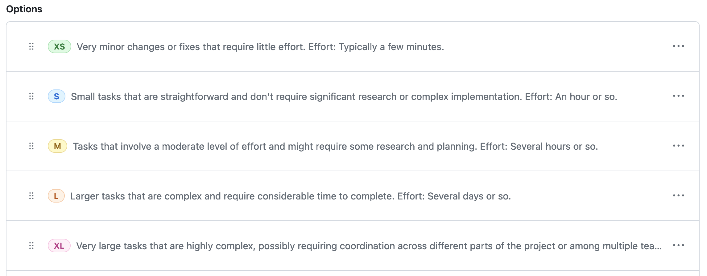
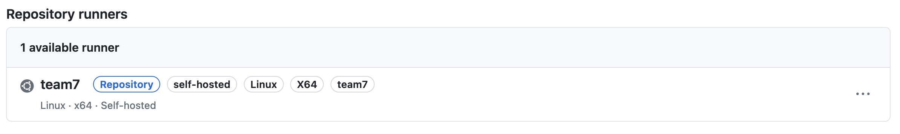

# Introduction
## Purpose

The Goal of this Document is to outline the activity of the quality assurance engineer, in a synthetic manner, in order to provide global understanding of the approach taken, the produced results and the conclusions reached.

Several other artefacts created with the goal of helping the quality assurance and the rest of the team achieving higher quality are available mostly on Github. The goal of the test plan is to act as an entry point to those.

Finally the test plan aims to help achieving a potential handing over of our team's activities  to another team, such as a team at Coris Innovation, for instance, or another future 3rd party working on ^^the solution^^.

## Product Analysis
### Customer/Business Requirements

Coris Innovation, represented by F. Anon, came to present the project to us on the Monday, March 11th, 2024.

At the end of this presentation, the project was officially initiated.

The goal of this project is to enhance existing research prototype solution named SportShield, in order to meet business and customer Requirements.

It consists of an ^^IOT^^ circuit, that acts as a ^^motherboard^^ for several additional components.

These ^^components^^, are either soldered or plugged to the motherboard.

You may find a full explanation of the project's goals and requirements in the functional specifications at [this link](https://github.com/algosup/2023-2024-project-4-sportshield-team-7/blob/main/specifications/functional_specification.md#11-overview)

You can find a full list of the documents in the technical specifications at [this link](https://github.com/algosup/2023-2024-project-4-sportshield-team-7/blob/main/specifications/technical_specification.md#1-work-environment).

### Functional and Technical Requirements

As identified in the [Functional](https://github.com/algosup/2023-2024-project-4-sportshield-team-7/blob/main/specifications/functional_specification.md) and [Technical](https://github.com/algosup/2023-2024-project-4-sportshield-team-7/blob/main/specifications/functional_specification.md) requirements, the solution will focus on extending the battery life of the existing research prototype, while trying to implement other less critical functions to the device.

## KPIs

The following metrics (^^KPIs^^) are provided by the customer and will be used in order to track the progress of the development of the solution.

| Metric | Target | Criticality |
|---|---|---|
| Shock detection | 99% | Critical |
| Battery Operation | 7 days of normal operation | Critical |
| Unlocking | 99% | Critical |
| Alarm | 98% | Very Important |
| Shock Notification | 95% | Very Important |
| GNSS Position and Acquisition | 80% | Important |

Internally we also have defined several KPIs in order to track the progress of the project.

Aside from those defined by the project management, the quality assurance will focus mainly on criticality/severity assessment of feature/bug, time estimations and bug rate of produced code or available hardware.

The complete list of tracked properties can be found in the tooling section following this link. <LINK> #fill

## Testing Fields

In order to precise the scope of the testing. 4 main fields have been defined to better understand the reach of the quality assurance activities.

Each field is divided into test suites, which have different meanings depending on the field.

### Hardware

This is the first and most obvious testing field of the project, as we have to ensure that the hardware is functional before attempting any software adjustments.

The hardware tests are essentially made up of initial condition checks, ongoing tests to verify how the hardware responds to different conditions and end to end testing to ensure the product is compliant before delivery.

You can find more extensive resources and maps of all hardware tests following [this link](https://github.com/algosup/2023-2024-project-4-sportshield-team-7/wiki/Test-Suite:-Initial-Condition-Check).

### Software

This is the second testing field of the project, which is the most important for tracking the progress of our developed solution.

The software testing field is heavily influenced by the customer's expectations, defined in the <LINK> metrics table in the KPI section. #fill

### Deliverables

The deliverables testing focuses on evaluating the quality of the various documents and artefacts handed over to the client before their previous.

Since the timespan of the project does not allow us the luxury of agility, the deliverables are essentially checked before their validation, the day before to be accurate.

This is sufficient to correct most typos and incoherences, allowing some time for refactoring while not wasting time correcting a document that is incomplete.

You can find more extensive resources and maps of all deliverables tests following [this link](https://github.com/algosup/2023-2024-project-4-sportshield-team-7/wiki/Test-Field:-Deliverables).

### Process

Aside from the solution and the deliverables, there are internal processes that can also be source of defects and blocks.
Processes testing aims to prevent them to hinder our progress.

# Tooling
## Overview (Diagram)

As defined in the next section <LINK> mentioned the QA workflow relies essentially on the Github Issues + Projects workflow, with the issues acting as tickets (test cases, reports, bug reports, feature requests etc.) and Projects serving as a database and visualisation tool of all the Issues. #fill

### Bug Resolution Process

### Test Case Creation/Execution

## Testing ID System

In order to organise and subdivide the testing fields into diverse testing suites, a test ID system has been created for easier reading and access. It works as follows:

Consider the following test ID:

> `Test ID: 0000500`

The ID needs to be read as such: `0-00-05-00`

> [!NOTE]
> Test IDs are always made up of 7 digits, and can contain 'X' instead of digits to indicate that the ID has no need for digits at that specific location.

#### Test Field

The first digit corresponds to the test field, which can have 4 different values:

- 0 --> Hardware Testing Field
- 1 --> Software Testing Field
- 2 --> Deliverables Testing Field
- 3 --> Processes Testing Field

In this case, the first digit is `0`, corresponding to the hardware field

#### Test Suite

The two following digits correspond to the test suite, which are a family of test suites that usually have a common objective or time frame.

In this example, it is `00`, which corresponds to the Initial Condition Check, which is the check performed upon receiving the hardware.

#### Test Sub-suite

The two following digits `05` represent the test sub-suite, which help break down the test categories even further.

In the context of "Initial Condition Check", a sub-suite is allocated to each component that needs to be checked at the beginning of the project.

Here, `05` corresponds to the tests linked to the battery component.

#### Test number

Finally, the last two digits `00` represent the test number within the sub-suite. In our example, it is a test for compliance of the voltage readings of the battery with its specifications.

Therefore, `Test 0000500` refers to: Hardware > Initial Condition Check > Battery > Voltage Reading Test

More information on all the available and planned test cases are available in [the wiki](https://github.com/algosup/2023-2024-project-4-sportshield-team-7/wiki).

## Github
### Issues

Issues are the fundamental work unit of the quality assurance's job.
They serve as:

- Test cases
- Test Reports (results)
- Bug Reports
- Document Reports (for deliverables) (stored in the bug report database, but has its own template)
- Feature Requests

This is based on [Linear's philosophy](https://linear.app/method?_rsc=wiqx5) to use issues as tickets for pretty much anything related to the development of the project.

> [!NOTE]
> Feature Requests are out of scope of the QA's work

A good way to visualise the power of Issues is to view some of them.

[Click here](https://github.com/algosup/2023-2024-project-4-sportshield-team-7/issues/1) for an example of a planned test case for checking the Functional Requirements before their publication.

[Click here](https://github.com/algosup/2023-2024-project-4-sportshield-team-7/issues/29) for an example of a planned test case for checking the integrity of the board's connections.

[Click here](https://github.com/algosup/2023-2024-project-4-sportshield-team-7/issues/30) for an example of a planned test case for checking the solidity of the PCB.

As you can see in those examples, issues are used simultaneously as test cases, test reports, and bug reports.

Conversations may be used to track discussions and updates on the tests, as such: !

### Templates

In order to create test cases, test reports and bug reports more efficiently, we have made use of a Github beta feature, called form templates.

These consist of yaml (`.yaml`) files placed in the `.github`folder from the root of the repository, that enable a contributor, QA, project owner or collaborator to quickly declare an "issue" in a format that will make processing by team members easier.

As of today, there are 4 templates:

- ### Bug Report form

    - The form name is pretty self explanatory. It has the particularity of setting the issue's label automatically to `bug` for easier triaging.

    - The forms are already well described in terms of fields and features, so they won't be described here, but you can view it[here](https://github.com/algosup/2023-2024-project-4-sportshield-team-7/issues/new?assignees=mathiskakal&labels=bug&projects=algosup%2F29&template=bug_report_form.yaml&title=%5BBUG%5D+INSERT_BUG_NAME).

- ### Test Case form

    - This form allows for the creation of a test case, which outlines the different.

    - You can view it [here](https://github.com/algosup/2023-2024-project-4-sportshield-team-7/issues/new?assignees=mathiskakal&labels=test&projects=algosup%2F29&template=test_case_form.yml&title=%5BTESTING%5D+%5BTEST_ID%5D+TEST_NAME).

- ### Feature Request form

    - This form allows for the creation of a feature request.

    - You can view it [here](https://github.com/algosup/2023-2024-project-4-sportshield-team-7/issues/new?assignees=mathiskakal&labels=feature&projects=algosup%2F32&template=feature_request.yaml&title=%5BFEATURE%5D+FEATURE_NAME).

- ### Document Suggestion

    - This form allows any contributor to declare a typo or an incoherence in a document. It is essentially a simpler "bug report".

    - You can view it [here](https://github.com/algosup/2023-2024-project-4-sportshield-team-7/issues/new?assignees=&labels=documentation&projects=&template=document-suggestion.md&title=%5BDOCS%5D+DOCUMENT_NAME). <LINK> #fill

- ### Projects

    - Github Projects help leverage this issue-driven workflow by creating customised views of issues and laying them out given issue metadata or properties, such as the status of the test (pending, pass, blocked and so on...)

    

    - 

    

    > This picture represents the test cases Github Projects.

    - The tests are classified by their Fields (red circle) (Hardware, Software, Deliverables, Processes)

    - They are then regrouped by their importance (orange circle)(P0 is most important, to P3, meaning trivial)

    - Finally, Among those groups, they are sorted by size estimates, to ensure the smallest tests that have the biggest impact are done first to get them out of the way. (green circle) (from XS to XL)

    - Here is a list of all the properties that can be added to an issue, regardless of the label (document, feature, test case etc.)

    - #### Status

    - The test status for project management.

    

    
    - 
    
    

    - #### Test Case ID

    - Takes in an string representing the test ID that should follow the test ID system. (Allows for easier triaging)

    - #### Priority

    

    
    - 
    
    

    - The priority perceived by the program management.

    - #### Iteration

    - The iteration (only for test cases) the test is part of. Refer to Iterations <LINK> #fill
    
    - #### Test Size

    

    
    - 
    
    

    - An estimate of the size of the task. Allows for better triaging and planning.

    - #### Start Date

    - Takes in a date, defines the date the test is supposed to be run or started if it spans over multiple days.

    - #### End Date

    - Takes in a date, defines the date the test is supposed to be ended.

    - #### Test Field

    - Is a manual way of indicating the test field since Github cannot process the test ID to do so.

    - #### Test Suite

    - Is a manual way of indicating the test suite since Github cannot process the test ID to do so.

    - #### Test Subsuite
    
    - Is a manual way of indicating the test subsuite since Github cannot process the test ID to do so.

    - #### Test Number

    - Is a manual way of indicating the test number since Github cannot process the test ID to do so.

    - #### Test Severity

    - Is the perceived severity of the reported bug.

    - #### Test Execution

    - Is the execution type of the test. Can be Automatic, Manual or both.
     
### Actions

    

In the context of a QA collaboration <LINK> #fill we have set up a testing environment for overnight tests (since we needed to leave the hardware at the school), using Github actions and Github workflows, running Ubuntu LTS 22.04.

The goal of this server is to provide a single testing platform for multiple groups, ensuring better consistency and increased quality of the product, since we could test other code on our hardware.

### Wiki

Finally, as this document is more a synthesis than a full collection of QA artefacts, you'll find the extensive results in the Wiki, which is a static website that allows for better navigation through those artefacts.

The wiki provides: full test results and reports, actions taken from those results, full planning and strategy of the tests and more a thorough explanation on the work undertaken by the QA.

You can find it from the main repository under the tab "Wiki" or by following this link <LINK> #fill

# Strategy

Now that we know what we need to test, and which tools we have at our disposal, we can proceed to plan tests over the time period we were given (4 weeks).
Let's first take a look at the milestones we have.

## Milestones

    

    

- Functional Specifications: 2024-03-18 Mon 17:00

- Technical Specifications: 2024-03-26 Tue 17:00

- Test plan: 2024-04-10 Wed 17:00

- User Manual: 2024-04-10 Wed 17:00

- Code: 2024-04-10 Wed 17:00

- Oral: 2024-04-19 Fri 09:00

## Iterations (Testing Phases)

    

    

### Exploratory Testing Phase

This is the first testing phase, it has multiple goals. Checking the hardware we have, and the possibilities we have with it.

We expect this testing to lead us to new test cases, a better comprehension of the device, and its inner workings, as well as a confirmation of its compliance with the data sheets.

During this phase, we will also delimit the perimeter and the scope of the testing.

Duration: 1 week.

### Testing Phase 1

This is the first testing phase, for which the main goal is to start tracking the KPIs <LINK> provided by the client against the first iteration of our solution to ensure that we will even be capable to reach the business/customer requirements. #fill

The results of the first testing phase will allow to tailor our efforts better, readjust the testing plan/strategy, and better prepare the next testing phase.

Duration: 1 week.

### Testing Phase 2

This is the second and last main testing phase, which is the last phase containing integration tests, as the following phase won't provide enough time for adding new features.

Duration: 1 week

### Final Testing Phase

This is the last product testing phase before the delivery. It will focus mainly on checking the quality of the delivered software and deliverables for the preparing the presentation.

Duration: 3 days

### Delivery Check

This additional testing phase aims to ensure that all the the material required for the presentation is ready and error free.

Duration: 1 day

## Daily reports
Since the quality assurance work affects the work of all the other team members, and since we don't have enough time to implement real sprints and thorough meetings, I decided to spend no more than 15-20 minutes per working day reporting all my findings and advancements at once to my colleagues whom are working in the same room as I, so no need for written documentation, apart from the GitHub issues that represent the said findings.

## QA Collaboration

#fill

# Results

Multiple factors hindering with the delivery of the product surfaced during the project.
Time constraints were the biggest issue. Out of 6 weeks on the project, only 3-4 could be used on it.

A little less than a week was given by the project overseer to the specification of the functional details of the project, which impacted all the subsequent documents and work, and didn't allow enough time to maturely assess the strategy and adjust the plan accordingly.

Internal communication within the team didn't help either because precious information (PCB schematics) have been held back at a crucial blocking point where we started considering giving up on a core aspect of the project (battery operation), since no representative testing could be done.

Indeed, during testing, we have found a PCB defect on the Sim 800L module, and combined, with the fact that the magnet couldn't work, this means that 2/3 of the most power hungry elements were unusable, rendering battery operation tests unrepresentative.

As a QA, I personally regret not spending more time helping the software engineer find workarounds to problems he might have needed an external view on, this project being a hardware project, which I only have basic knowledge of.

Apart from the NFC, which seems to need more time for porting an existing NFC library to our platform to make it compatible, all of our other tests and results from other groups have shown that the other components such as the movement sensor, the bluetooth connection with the device, the sound alarm, and the GPS functionality all work well and have successfully been implemented.
