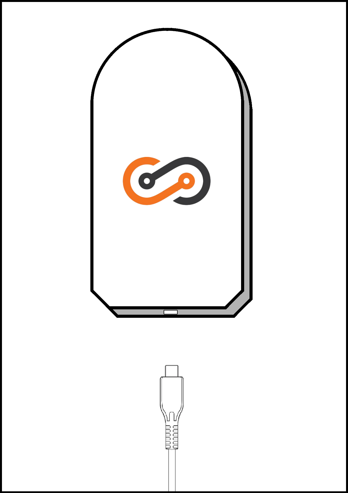
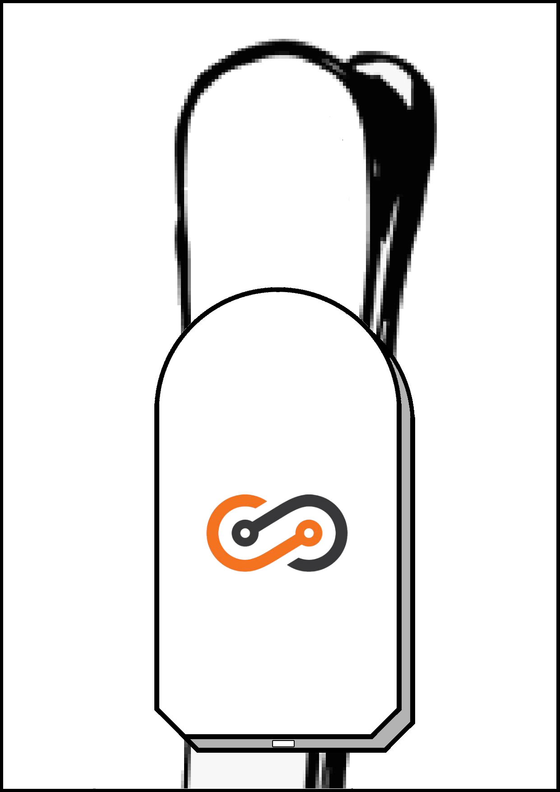
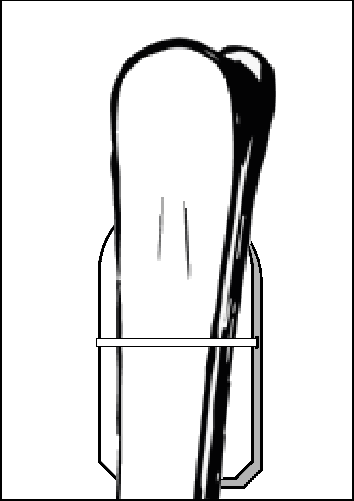
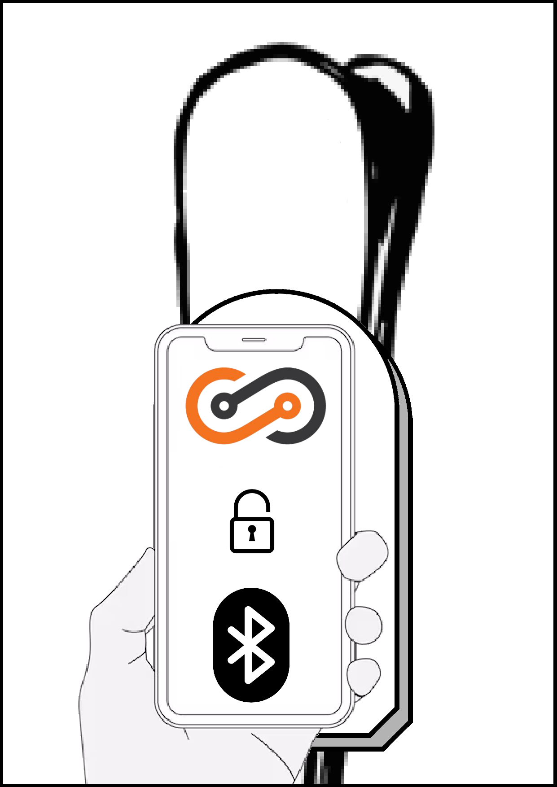
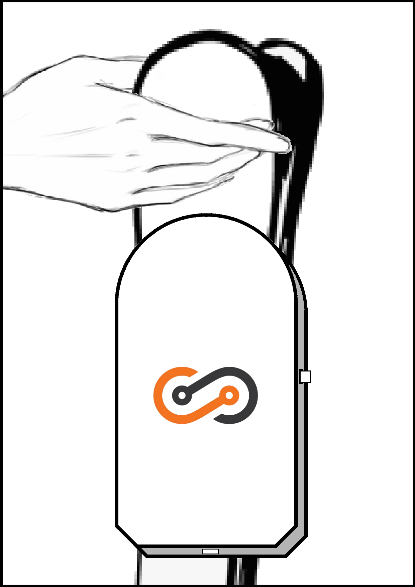
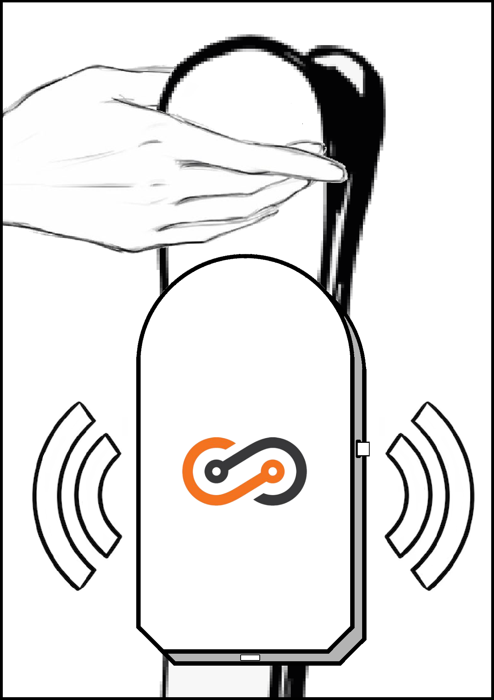
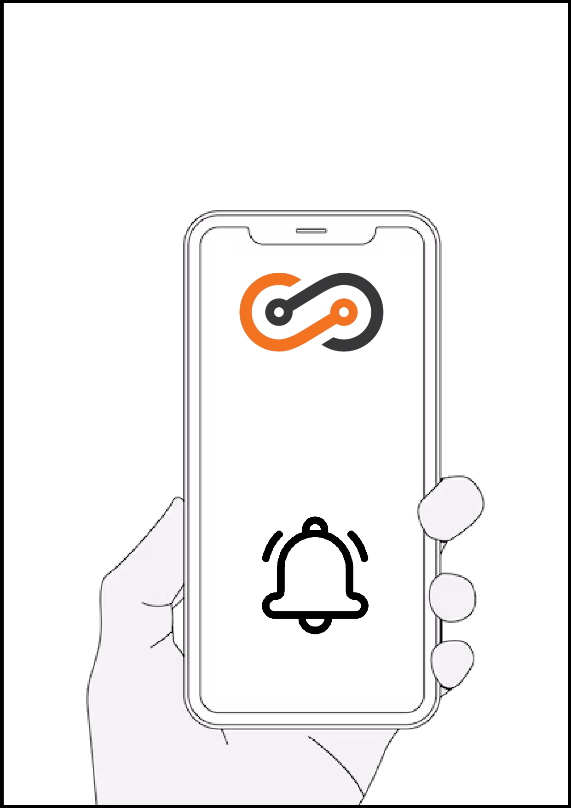
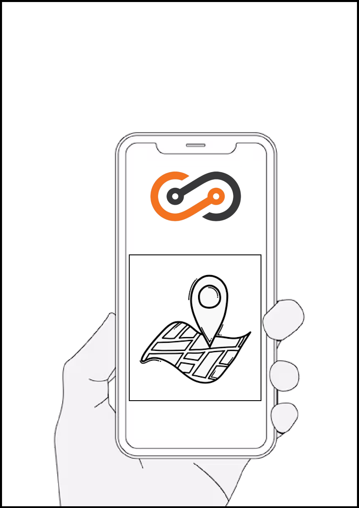

# User Manual

## Content

- 1 SportShield device
- 1 USB to USB-C cable
- 1 User Manual

## Specifications

- **Battery**: 3.7V 500mAh
	- **Charging time**: 2 hours
	- **Working time**: 7 days (Working time may vary depending on the usage)
- **Sensors**: 3-axis accelerometer
- **Compatibility**: Android 4.4 and above, iOS 8.0 and above
- **Buzzer**: 90 - 100 dB
- **Bluetooth**: 4.0
- **Size**: 240mm x 16mm x 10mm

<!-- ## Update -->

<!-- // TODO - Add update information and How to update. -->

## Step by Step

### Step 1: Charge the device

1. Connect the provided USB cable to the device.
2. Connect the USB cable to a power source.
3. Once the device is fully charged, disconnect the USB cable from the device.

### Step 2: Turn on the device

1. The device will automatically turn on as soon as it has enough battery (You will be able to check the battery level by looking at the application, once installed).

### Step 3: Pair the device with your phone

1. Download the application from the App Store or Google Play Store.
2. Open the application.
3. Follow the instructions on the screen to pair the device with your phone.
4. Once the device is paired, you can start using it.

### Step 4: Set up the device

1. Put the device on your ski.
2. Take the cable out of the device.
3. Go around the ski and put the cable on the other side of the device.
4. Make sure the device is securely attached to the ski.
5. Use the application to lock the cable to the device.
6. Try to pull on the cable to make sure it is securely attached to the device.

### Step 5: Tidy up the device

1. Make sure the device is securely attached to the skis.
2. Make sure the cable is not tangled.
3. Make sure the device is not obstructed by any other objects.
4. Use the application to unlock the cable from the device.
5. Put the cable back in the device.

# Paper Version

